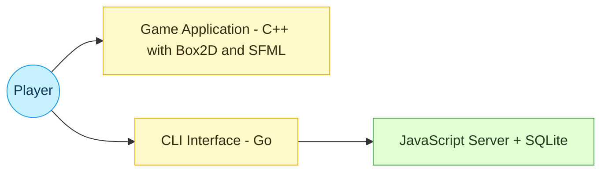
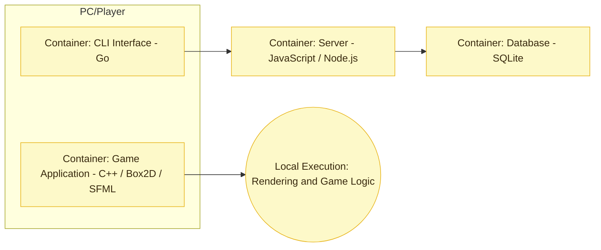
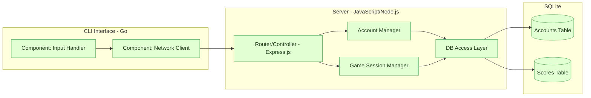
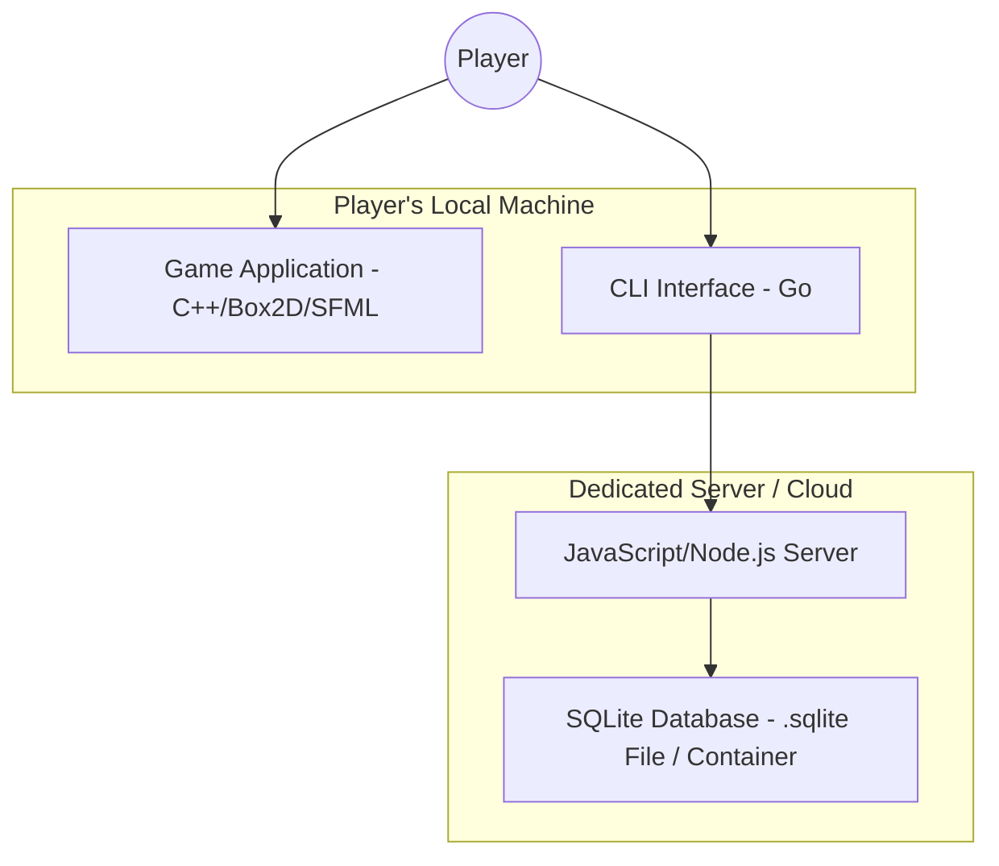

# C4 Diagrams

## Context Diagram (Level 1)

```mermaid
flowchart LR
    A((Player))
    A --> B[Game Application - C++ with Box2D and SFML]
    A --> C[CLI Interface - Go]
    C --> D[JavaScript Server + SQLite]

    classDef actor fill:#c7f1ff,stroke:#1B9BE5,stroke-width:1px,color:#0B375A
    classDef system fill:#fdf9c9,stroke:#e8b61f,stroke-width:1px,color:#38290e
    classDef backend fill:#e2ffd4,stroke:#57a957,stroke-width:1px,color:#1e3e1e

    class A actor
    class B system
    class C system
    class D backend
```

---

## Container Diagram (Level 2)

```mermaid
flowchart LR
    subgraph ClientSide [PC/Player]
        G[Container: Game Application - C++ / Box2D / SFML]
        T[Container: CLI Interface - Go]
    end

    S[Container: Server - JavaScript / Node.js]
    DB[Container: Database - SQLite]

    G --> GNote((Local Execution: Rendering and Game Logic))
    T --> S
    S --> DB

    classDef container fill:#fdf9c9,stroke:#e8b61f,stroke-width:1px,color:#38290e

    class G container
    class T container
    class S container
    class DB container
    class GNote container
```

---

## Component Diagram (Level 3)

```mermaid
flowchart LR
    subgraph TerminalCLI [CLI Interface - Go]
        T1[Component: Input Handler]
        T2[Component: Network Client]
    end

    subgraph NodeServer [Server - JavaScript/Node.js]
        SJ1[Router/Controller - Express.js]
        SJ2[Account Manager]
        SJ3[Game Session Manager]
        SJ4[DB Access Layer]
    end

    subgraph DB [SQLite]
        DB1[(Accounts Table)]
        DB2[(Scores Table)]
    end

    T1 --> T2
    T2 --> SJ1
    SJ1 --> SJ2
    SJ1 --> SJ3
    SJ2 --> SJ4
    SJ3 --> SJ4
    SJ4 --> DB1
    SJ4 --> DB2

    classDef comp fill:#e2ffd4,stroke:#57a957,stroke-width:1px,color:#1e3e1e
    class T1,T2,SJ1,SJ2,SJ3,SJ4,DB1,DB2 comp
```

---

## Deployment Diagram (Level 4)

```mermaid
flowchart TB
    subgraph LocalMachine [Player's Local Machine]
        A[Game Application - C++/Box2D/SFML]
        B[CLI Interface - Go]
    end

    subgraph RemoteServer [Dedicated Server / Cloud]
        C[JavaScript/Node.js Server]
        D[SQLite Database - .sqlite File / Container]
    end

    User((Player)) --> A
    User --> B
    B --> C
    C --> D
```
